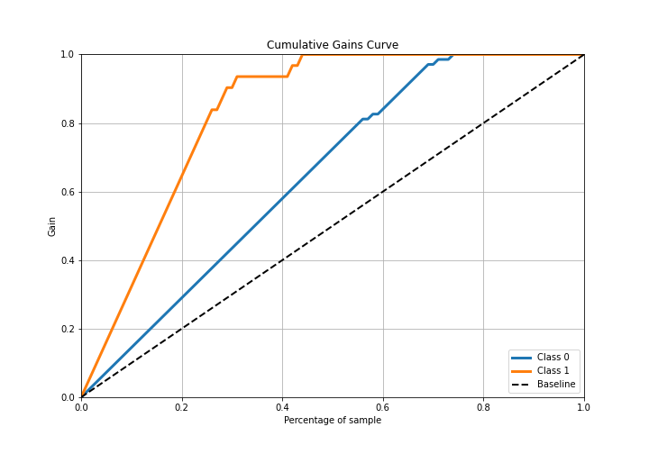

# Summary of 1_Default_NeuralNetwork

[<< Go back](../README.md)

## Neural Network
- **n_jobs**: -1
- **dense_1_size**: 32
- **dense_2_size**: 16
- **learning_rate**: 0.05
- **explain_level**: 2

## Validation
 - **validation_type**: split
 - **train_ratio**: 0.75
 - **shuffle**: True
 - **stratify**: True

## Optimized metric
logloss

## Training time

29.5 seconds

## Metric details
|           |    score |     threshold |
|:----------|---------:|--------------:|
| logloss   | 0.263876 | nan           |
| auc       | 0.986442 | nan           |
| f1        | 0.933333 |   0.455407    |
| accuracy  | 0.96     |   0.455407    |
| precision | 1        |   1           |
| recall    | 1        |   1.04834e-20 |
| mcc       | 0.905834 |   0.455407    |

## Confusion matrix (at threshold=0.455407)
|              |   Predicted as 0 |   Predicted as 1 |
|:-------------|-----------------:|-----------------:|
| Labeled as 0 |               68 |                1 |
| Labeled as 1 |                3 |               28 |

## Learning curves

## Permutation-based Importance

## Confusion Matrix

## Normalized Confusion Matrix

## ROC Curve

## Kolmogorov-Smirnov Statistic

## Precision-Recall Curve

## Calibration Curve

## Cumulative Gains Curve

## Lift Curve

[<< Go back](../README.md)
