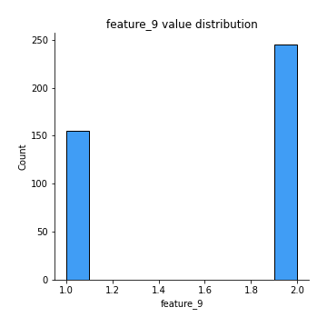
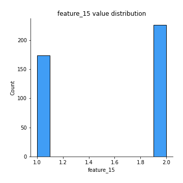

# Exploratory Data Analysis

[<< Go back](../README.md)
## Feature : target
- **Feature type** : categorical
- **Missing** : 0.0%
- **Unique** : 2
- **Count** :400
- **Unique** :2
- **Top** :0
- **Freq** :275

## Feature : feature_1
- **Feature type** : continous
- **Missing** : 0.0%
- **Unique** : 2
- **Count** :400.0
- **Mean** :1.5325
- **Std** :0.49956748210120056
- **Min** :1.0
- **25%th Percentile** : 1.0
- **50%th Percentile** : 2.0
- **75%th Percentile** : 2.0
- **Max** :2.0

## Feature : feature_2
- **Feature type** : continous
- **Missing** : 0.0%
- **Unique** : 2
- **Count** :400.0
- **Mean** :1.415
- **Std** :0.49333909093707057
- **Min** :1.0
- **25%th Percentile** : 1.0
- **50%th Percentile** : 1.0
- **75%th Percentile** : 2.0
- **Max** :2.0

## Feature : feature_3
- **Feature type** : continous
- **Missing** : 0.0%
- **Unique** : 2
- **Count** :400.0
- **Mean** :1.455
- **Std** :0.498594515842354
- **Min** :1.0
- **25%th Percentile** : 1.0
- **50%th Percentile** : 1.0
- **75%th Percentile** : 2.0
- **Max** :2.0

## Feature : feature_4
- **Feature type** : continous
- **Missing** : 0.0%
- **Unique** : 4
- **Count** :400.0
- **Mean** :2.78
- **Std** :0.8795077228691437
- **Min** :1.0
- **25%th Percentile** : 2.0
- **50%th Percentile** : 3.0
- **75%th Percentile** : 3.25
- **Max** :4.0

## Feature : feature_5
- **Feature type** : continous
- **Missing** : 0.0%
- **Unique** : 5
- **Count** :400.0
- **Mean** :2.5025
- **Std** :1.5184723064196521
- **Min** :1.0
- **25%th Percentile** : 1.0
- **50%th Percentile** : 2.0
- **75%th Percentile** : 4.0
- **Max** :5.0

## Feature : feature_6
- **Feature type** : continous
- **Missing** : 0.0%
- **Unique** : 4
- **Count** :400.0
- **Mean** :1.8275
- **Std** :0.8886608155605714
- **Min** :1.0
- **25%th Percentile** : 1.0
- **50%th Percentile** : 2.0
- **75%th Percentile** : 2.0
- **Max** :4.0

## Feature : feature_7
- **Feature type** : continous
- **Missing** : 0.0%
- **Unique** : 4
- **Count** :400.0
- **Mean** :3.5675
- **Std** :0.6335987440178948
- **Min** :1.0
- **25%th Percentile** : 3.0
- **50%th Percentile** : 4.0
- **75%th Percentile** : 4.0
- **Max** :4.0

## Feature : feature_8
- **Feature type** : continous
- **Missing** : 0.0%
- **Unique** : 3
- **Count** :400.0
- **Mean** :2.5625
- **Std** :0.7566538592095078
- **Min** :1.0
- **25%th Percentile** : 2.0
- **50%th Percentile** : 3.0
- **75%th Percentile** : 3.0
- **Max** :3.0

## Feature : feature_9
- **Feature type** : continous
- **Missing** : 0.0%
- **Unique** : 2
- **Count** :400.0
- **Mean** :1.6125
- **Std** :0.4877895001855086
- **Min** :1.0
- **25%th Percentile** : 1.0
- **50%th Percentile** : 2.0
- **75%th Percentile** : 2.0
- **Max** :2.0

## Feature : feature_10
- **Feature type** : continous
- **Missing** : 0.0%
- **Unique** : 2
- **Count** :400.0
- **Mean** :1.4875
- **Std** :0.5004697041900051
- **Min** :1.0
- **25%th Percentile** : 1.0
- **50%th Percentile** : 1.0
- **75%th Percentile** : 2.0
- **Max** :2.0

## Feature : feature_11
- **Feature type** : continous
- **Missing** : 0.0%
- **Unique** : 2
- **Count** :400.0
- **Mean** :1.5275
- **Std** :0.4998684037350548
- **Min** :1.0
- **25%th Percentile** : 1.0
- **50%th Percentile** : 2.0
- **75%th Percentile** : 2.0
- **Max** :2.0

## Feature : feature_12
- **Feature type** : continous
- **Missing** : 0.0%
- **Unique** : 2
- **Count** :400.0
- **Mean** :1.5075
- **Std** :0.5005698507087661
- **Min** :1.0
- **25%th Percentile** : 1.0
- **50%th Percentile** : 2.0
- **75%th Percentile** : 2.0
- **Max** :2.0

## Feature : feature_13
- **Feature type** : continous
- **Missing** : 0.0%
- **Unique** : 2
- **Count** :400.0
- **Mean** :1.46
- **Std** :0.49902159912270183
- **Min** :1.0
- **25%th Percentile** : 1.0
- **50%th Percentile** : 1.0
- **75%th Percentile** : 2.0
- **Max** :2.0

## Feature : feature_14
- **Feature type** : continous
- **Missing** : 0.0%
- **Unique** : 2
- **Count** :400.0
- **Mean** :1.4825
- **Std** :0.5003194468259065
- **Min** :1.0
- **25%th Percentile** : 1.0
- **50%th Percentile** : 1.0
- **75%th Percentile** : 2.0
- **Max** :2.0

## Feature : feature_15
- **Feature type** : continous
- **Missing** : 0.0%
- **Unique** : 2
- **Count** :400.0
- **Mean** :1.565
- **Std** :0.4963778575275177
- **Min** :1.0
- **25%th Percentile** : 1.0
- **50%th Percentile** : 2.0
- **75%th Percentile** : 2.0
- **Max** :2.0

## Feature : feature_16
- **Feature type** : continous
- **Missing** : 0.0%
- **Unique** : 2
- **Count** :400.0
- **Mean** :1.46
- **Std** :0.49902159912270194
- **Min** :1.0
- **25%th Percentile** : 1.0
- **50%th Percentile** : 1.0
- **75%th Percentile** : 2.0
- **Max** :2.0

[<< Go back](../README.md)
