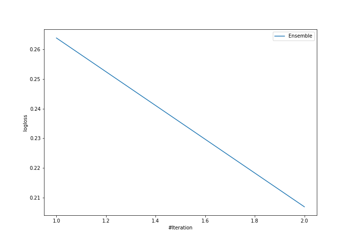
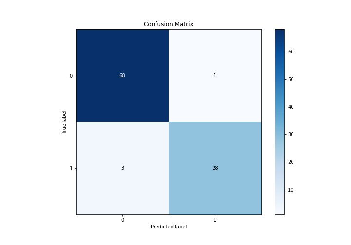
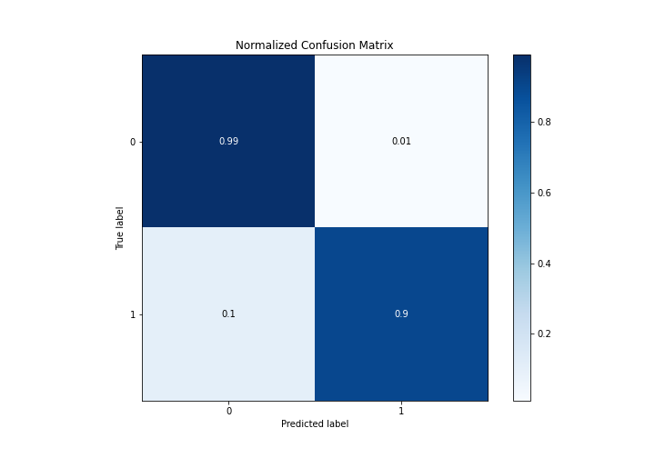
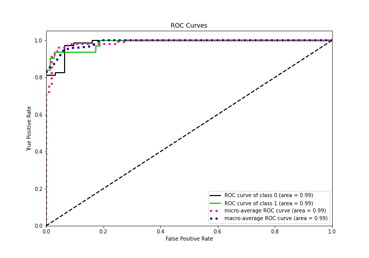
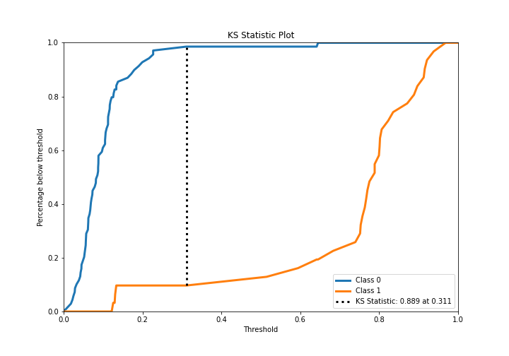
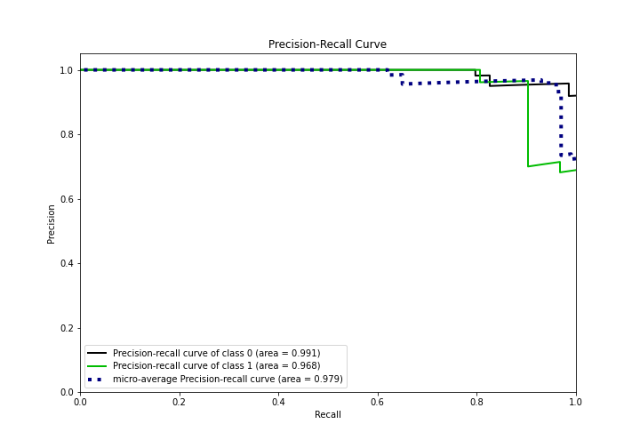
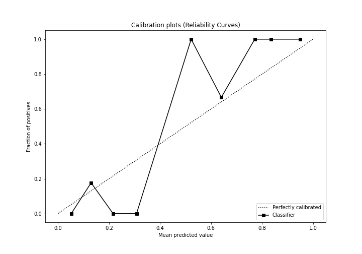
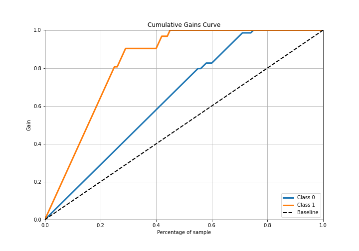
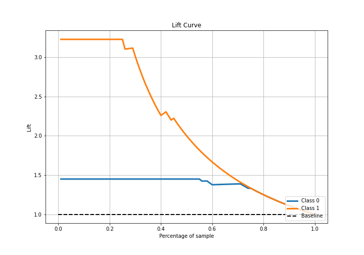

# Summary of Ensemble

[<< Go back](../README.md)

## Ensemble structure
| Model                   |   Weight |
|:------------------------|---------:|
| 1_Default_NeuralNetwork |        1 |
| 2_Default_RandomForest  |        1 |

## Metric details
|           |    score |   threshold |
|:----------|---------:|------------:|
| logloss   | 0.206847 | nan         |
| auc       | 0.980832 | nan         |
| f1        | 0.933333 |   0.353753  |
| accuracy  | 0.96     |   0.353753  |
| precision | 1        |   0.829735  |
| recall    | 1        |   0.0166113 |
| mcc       | 0.905834 |   0.353753  |

## Confusion matrix (at threshold=0.353753)
|              |   Predicted as 0 |   Predicted as 1 |
|:-------------|-----------------:|-----------------:|
| Labeled as 0 |               68 |                1 |
| Labeled as 1 |                3 |               28 |

## Learning curves

## Confusion Matrix

## Normalized Confusion Matrix

## ROC Curve

## Kolmogorov-Smirnov Statistic

## Precision-Recall Curve

## Calibration Curve

## Cumulative Gains Curve

## Lift Curve

[<< Go back](../README.md)
