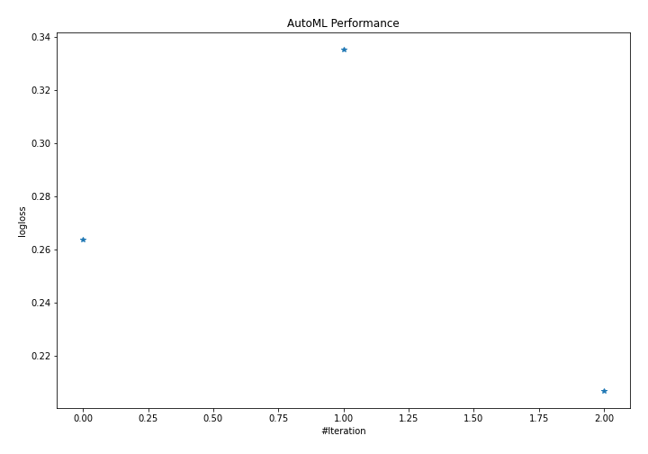
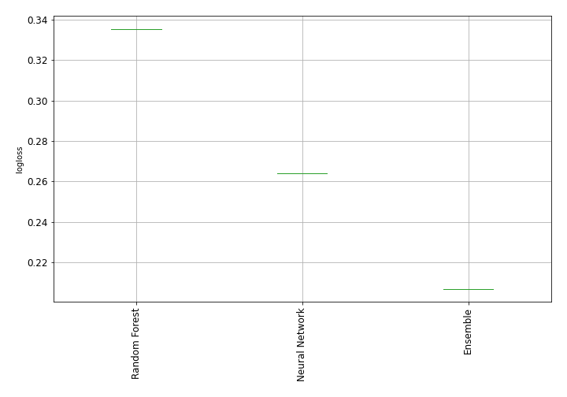
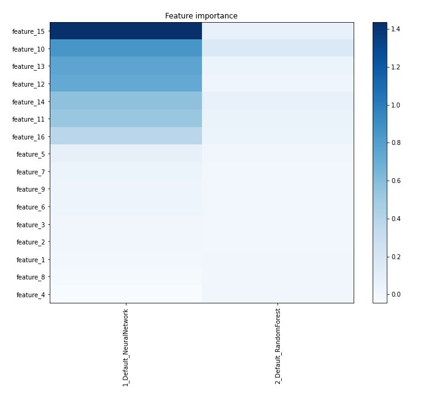
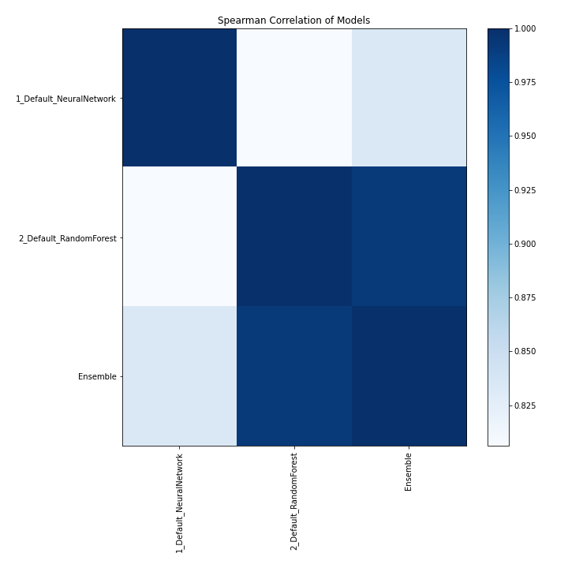

# AutoML Leaderboard

| Best model   | name                                                         | model_type     | metric_type   |   metric_value |   train_time |
|:-------------|:-------------------------------------------------------------|:---------------|:--------------|---------------:|-------------:|
|              | [1_Default_NeuralNetwork](1_Default_NeuralNetwork/README.md) | Neural Network | logloss       |       0.263876 |        31.67 |
|              | [2_Default_RandomForest](2_Default_RandomForest/README.md)   | Random Forest  | logloss       |       0.335263 |        16.33 |
| **the best** | [Ensemble](Ensemble/README.md)                               | Ensemble       | logloss       |       0.206847 |         1.22 |

### AutoML Performance

### AutoML Performance Boxplot

### Features Importance

### Spearman Correlation of Models

